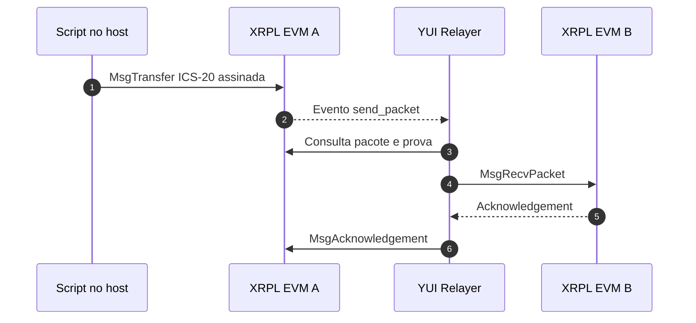

<div align="center" id="topo">

# <code><strong>Módulo XRPL EVM para interoperabilidade IBC</strong></code>

Ambiente local e modular para inicializar XRPL EVM Sidechains independentes e integrá-las a um relayer IBC externo.

[](https://go.dev/)
[](https://docs.docker.com/engine/)
[](https://docs.docker.com/compose/)
[](https://www.python.org/)
[](https://opensource.ripple.com/docs/evm-sidechain/intro-to-evm-sidechain/)
[](https://ibcprotocol.dev/)

</div>

---

# 📑 Índice

- [📌 Sobre](#sobre)
- [🧩 Responsabilidades do módulo](#responsabilidades)
- [🏗️ Arquitetura](#arquitetura)
- [📂 Estrutura do projeto](#estrutura)
- [⚙️ Configuração declarativa](#configuracao)
- [🚀 Ciclo completo XRPL A ↔ XRPL B](#execucao)
- [🧰 Comandos do módulo](#comandos)
- [➕ Adicionar ou atualizar uma chain](#nova-chain)
- [🧹 Persistência e limpeza](#limpeza)
- [🔗 Código-fonte](#codigo-fonte)

---

<a id="sobre"></a>
# 📌 Sobre

Este repositório representa o módulo XRPL da arquitetura de
interoperabilidade. Ele constrói e executa três XRPL EVM Sidechains locais,
cada uma com estado, chain ID, IP e portas independentes:

| Nome | Chain ID | IP Docker | RPC Cosmos | REST | RPC EVM |
|---|---|---:|---:|---:|---:|
| `xrplevm-a` | `xrplevm_1450001-1` | `172.30.0.10` | `26657` | `1317` | `8545` |
| `xrplevm-b` | `xrplevm_1450002-1` | `172.30.0.11` | `36657` | `2317` | `9545` |
| `xrplevm-c` | `xrplevm_1450003-1` | `172.30.0.12` | `46657` | `3317` | `10545` |

O ativo nativo das chains é `axrp`:

```text
1 XRP = 1000000000000000000 axrp
```

As chains utilizam a rede Docker externa `interoperability_network` para se
comunicar com outros módulos de blockchain e com um relayer IBC standalone.

[⬆️ Voltar ao topo](#topo)

---

<a id="responsabilidades"></a>
# 🧩 Responsabilidades do módulo

O módulo XRPL é responsável por:

- validar os descritores das chains e das contas;
- gerar o `docker-compose.yaml`;
- criar ou validar a rede Docker compartilhada;
- construir, inicializar e reconciliar as XRPL EVM Sidechains;
- preservar o estado on-chain em volumes Docker;
- financiar as contas dos relayers com XRP;
- fornecer scripts de transferência e consulta de saldo.

O módulo não registra chains no relayer, não cria paths IBC e não inicia o
serviço contínuo de relay. Essas operações pertencem ao módulo YUI Relayer e
devem ser realizadas de forma independente.

[⬆️ Voltar ao topo](#topo)

---

<a id="arquitetura"></a>
# 🏗️ Arquitetura



O script de transferência envia a transação somente para a chain de origem. O
YUI, previamente configurado e em execução, observa o evento, transporta o
pacote e devolve o acknowledgement.

[⬆️ Voltar ao topo](#topo)

---

<a id="estrutura"></a>
# 📂 Estrutura do projeto

```text
xrpl-cosmos/
├── config/
│   ├── profile.json             # características comuns das XRPL EVM
│   ├── chains.json              # identidade, IP e portas das chains
│   ├── user-accounts.json       # contas de usuário do módulo
│   └── relayer-accounts.json    # contas que devem operar o relay
├── src/
│   ├── main.py                  # entrada do módulo XRPL
│   └── modules/                 # configuração, lifecycle e funding
├── tests/
│   ├── transfer_to_xrpl.py      # transferência XRPL ↔ XRPL
│   ├── transfer_to_cosmos.py    # transferência XRPL → Cosmos
│   ├── check_balance.py         # consulta unificada de saldos
├── scripts/
│   └── start-persistent.sh      # inicialização persistente do exrpd
├── Dockerfile                   # imagem local do XRPL EVM Node
├── docker-compose.yaml          # Compose gerado pelo módulo
├── .env.example                 # modelo da rede compartilhada
└── requirements.txt             # dependências dos scripts Python
```

O `docker-compose.yaml` é gerado pelo módulo. As fontes declarativas ficam em
`config/` e devem ser alteradas em vez de editar diretamente o Compose.

[⬆️ Voltar ao topo](#topo)

---

<a id="configuracao"></a>
# ⚙️ Configuração declarativa

| Arquivo | Responsabilidade |
|---|---|
| `profile.json` | adapter, prefixo Bech32, ativo nativo, gas e parâmetros de light client |
| `chains.json` | nome lógico, chain ID, serviço Docker, IP e portas de cada chain |
| `user-accounts.json` | contas de usuário e chains às quais pertencem |
| `relayer-accounts.json` | contas de relayer associadas individualmente às chains |

O campo `name` é a identidade lógica usada nos comandos. Por exemplo, a opção
`--chain xrplevm-a` seleciona somente a primeira chain.

O arquivo `.env` define a rede Docker compartilhada:

```dotenv
DOCKER_NETWORK_DRIVER=bridge
DOCKER_NETWORK_PARENT=
DOCKER_NETWORK_NAME=interoperability_network
DOCKER_SUBNET=172.30.0.0/24
DOCKER_GATEWAY=172.30.0.1

YUI_RELAYER_CONTAINER=yui-relayer
```

`YUI_RELAYER_CONTAINER` é usado apenas pelos testes que precisam consultar os
paths do relayer já configurado.

[⬆️ Voltar ao topo](#topo)

---

<a id="execucao"></a>
# 🚀 Ciclo completo XRPL A ↔ XRPL B

## 1. Clonar o módulo XRPL

```bash
git clone https://github.com/brunolima2696/xrpl-cosmos.git
cd xrpl-cosmos
```

O YUI Relayer é um módulo standalone e não precisa estar dentro deste
repositório para que as XRPL sejam inicializadas.

## 2. Preparar o Python

No Git Bash do Windows:

```bash
python -m venv .venv
source .venv/Scripts/activate
python -m pip install -r requirements.txt
```

No Linux, ative o ambiente com:

```bash
source .venv/bin/activate
```

Confirme o interpretador:

```bash
python -c "import sys; print(sys.executable)"
```

## 3. Configurar o ambiente

```bash
cp .env.example .env
```

Revise o driver, a faixa de endereços e o nome da rede antes de continuar. Os
IPs declarados em `config/chains.json` devem pertencer à subnet escolhida.

## 4. Validar os descritores

```bash
python src/main.py validate
```

Esse comando não chama executáveis externos. Ele lê e valida internamente:

- `config/profile.json`;
- `config/chains.json`;
- `config/user-accounts.json`;
- `config/relayer-accounts.json`;
- `.env`.


O comando valida `config/`, `.env`, identidades, portas e endereços sem alterar
o ambiente.

## 5. Inicializar as XRPL EVM Sidechains

```bash
python src/main.py init
```

<details>
<summary>Comandos encapsulados</summary>

O fluxo executa, conforme o estado encontrado:

```bash
docker compose version
docker info --format "{{.ServerVersion}}"
docker compose -f docker-compose.yaml ps --all --quiet <service>
docker inspect <container-id>
docker network inspect interoperability_network
docker network create --driver bridge \
  --subnet 172.30.0.0/24 \
  --gateway 172.30.0.1 \
  interoperability_network
docker compose -f docker-compose.yaml build <services>
docker compose -f docker-compose.yaml up -d --no-build <services>
```

A criação da rede, o build e o `up` são condicionais. Ao final, o Python faz
consultas HTTP aos endpoints RPC, REST e EVM de cada chain.

</details>

O ciclo de inicialização:

1. valida os descritores;
2. gera `docker-compose.yaml`;
3. verifica o Docker;
4. compara o estado desejado com os containers existentes;
5. cria ou valida `interoperability_network`;
6. constrói a imagem quando necessário;
7. cria, recria ou mantém cada container;
8. aguarda RPC Cosmos, REST e RPC EVM responderem;
9. confirma os chain IDs encontrados.

O comando é reconciliador. Se uma chain já estiver ativa com os mesmos
parâmetros, seu container será mantido. Se a configuração declarada mudar, o
Compose será regenerado e somente as chains afetadas serão reconciliadas.

Consulte o estado:

```bash
python src/main.py status
```

<details>
<summary>Comandos encapsulados</summary>

```bash
docker compose version
docker info --format "{{.ServerVersion}}"
docker compose -f docker-compose.yaml ps
```

</details>


Para acompanhar uma chain específica:

```bash
python src/main.py logs xrplevm-a --follow
```

<details>
<summary>Comandos encapsulados</summary>

```bash
docker compose -f docker-compose.yaml logs \
  --tail 100 \
  --follow \
  xrplevm-a
```

</details>

## 6. Financiar as contas dos relayers

O financiamento pertence ao módulo XRPL. Envie o valor padrão de `1000 XRP`
para os relayers das chains A e B:

```bash
python src/main.py fund-relayers \
  --chain xrplevm-a \
  --chain xrplevm-b
```

<details>
<summary>Comandos encapsulados</summary>

Faz o equivalente a:

- Para XRPL EVM A:
```bash
docker compose exec -T xrplevm-a \
  /app/bin/exrpd tx bank send \
  alice \
  ethm1ad3lc5tswq7vgc4rqsa0ad9yg5zcsy3f2vgazj \
  1000000000000000000000axrp \
  --from alice \
  --chain-id xrplevm_1450001-1 \
  --home /app/.exrpd \
  --keyring-backend test \
  --node tcp://localhost:26657 \
  --gas auto \
  --gas-adjustment 1.5 \
  --gas-prices 1axrp \
  --output json \
  -y
```

- Para XRPL EVM B:
  
```bash
docker compose exec -T xrplevm-b \
  /app/bin/exrpd tx bank send \
  alice \
  ethm177zt9jh86mp54zrl9vk2g7q6g69jzvsnl2qt8f \
  1000000000000000000000axrp \
  --from alice \
  --chain-id xrplevm_1450002-1 \
  --home /app/.exrpd \
  --keyring-backend test \
  --node tcp://localhost:26657 \
  --gas auto \
  --gas-adjustment 1.5 \
  --gas-prices 1axrp \
  --output json \
  -y
```

O script de funding faz a transação EVM pelo RPC do host, enquanto os comandos descritos
usando o binário `exrpd` e o módulo `bank` do Cosmos SDK.

</details>

Para escolher outro valor por conta:

```bash
python src/main.py fund-relayers \
  --chain xrplevm-a \
  --chain xrplevm-b \
  --amount 100
```


## 7. Confirmar o relayer externo

Antes da transferência, considere que o YUI Relayer standalone já foi:

- conectado à `interoperability_network`;
- configurado com `xrplevm-a` e `xrplevm-b`;
- provisionado com um path IBC entre as duas chains;
- iniciado para relayar continuamente nesse path.

O módulo XRPL não executa essas etapas. O teste consulta o container indicado
por `YUI_RELAYER_CONTAINER` apenas para descobrir automaticamente o port e o
channel do path existente.

<details>
<summary>Manualmente:</summary>

Para descobrir o channel utilizado no path escolhido:

```bash
docker exec yui-relayer yrly paths list --json 2>/dev/null | jq -r '
  to_entries[]
  | select(
      ([.value.src["chain-id"], .value.dst["chain-id"]] | sort)
      == (["xrplevm_1450001-1", "xrplevm_1450002-1"] | sort)
    )
  | . as $path
  | (
      if .value.src["chain-id"] == "xrplevm_1450001-1"
      then .value.src
      else .value.dst
      end
    ) as $source
  | "\($path.key) port=\($source["port-id"]) channel=\($source["channel-id"])"
'
```

E a saída esperada será do tipo:

```bash
xrplevm-a-b port=transfer channel=channel-N
```

</details>

## 8. Consultar os saldos iniciais

Saldo da Alice na XRPL A:

```bash
python tests/check_balance.py xrplevm-a alice
```

Saldo da Alice na XRPL B:

```bash
python tests/check_balance.py xrplevm-b alice
```

>[!Note]
> O script consulta `yui-relayer/runtime/manifest.json` para obter informações das chains.
> A variável `YUI_RELAYER_RUNTIME` no `.env` deve apontar para o diretório `yui-relayer/runtime`.

<details>
<summary>Comandos encapsulados</summary>

- Consulta Alice XRPL EVM A:

```bash
docker compose exec -T xrplevm-a \
  /app/bin/exrpd query bank balances \
  ethm1dakgyqjulg29m5fmv992g2y66m9g2mjn6hahwg \
  --node tcp://localhost:26657 \
  --output json
```

- Consulta Alice XRPL EVM B:

```bash
docker compose exec -T xrplevm-b \
  /app/bin/exrpd query bank balances \
  ethm1dakgyqjulg29m5fmv992g2y66m9g2mjn6hahwg \
  --node tcp://localhost:26657 \
  --output json
```

</detais>

## 9. Transferir XRPL A → XRPL B

```bash
python tests/transfer_to_xrpl.py \
  xrplevm-a alice \
  xrplevm-b alice
```

<details>
<summary>Comandos encapsulados</summary>

O teste executa o equivalente a:

```bash
docker exec yui-relayer yrly paths list --json
```

Para descobrir o channel, e na sequência:

```bash
docker compose exec -T xrplevm-a \
  /app/bin/exrpd tx ibc-transfer transfer \
  transfer <channel-N> \
  ethm1dakgyqjulg29m5fmv992g2y66m9g2mjn6hahwg \
  1000000000000000000axrp \
  --from alice \
  --chain-id xrplevm_1450001-1 \
  --home /app/.exrpd \
  --keyring-backend test \
  --node tcp://localhost:26657 \
  --gas 400000 \
  --fees 20000000000000000axrp \
  --packet-timeout-timestamp 1000000000000 \
  --output json \
  -y
```

Onde `channel-N` é obtido na saída do primeiro comando.


</details>

O teste:

1. valida as chains e as contas declaradas em `config/`;
2. consulta no YUI o channel da origem;
3. obtém `account_number` e `sequence` pela REST da XRPL A;
4. cria uma `MsgTransfer` de `1 XRP` (`1000000000000000000 axrp`);
5. monta e assina a transação no host com a chave da Alice;
6. transmite o `TxRaw` ao RPC Tendermint da XRPL A.

Uma submissão aceita na origem retorna `Code: 0` e um `TxHash`. O YUI ativo
transportará o pacote e o acknowledgement.

## 10. Validar o voucher na XRPL B

Após o relay, repita a consulta da XRPL B:

```bash
python tests/check_balance.py xrplevm-b alice
```
<details>
<summary>Alternativamente:</summary>

```bash
docker compose exec -T xrplevm-b \
  /app/bin/exrpd query bank balances \
  ethm1dakgyqjulg29m5fmv992g2y66m9g2mjn6hahwg \
  --node tcp://localhost:26657 \
  --output json
```

</details>

O XRP originado na XRPL A aparecerá na XRPL B como:

```text
ibc/<hash>
```


## 11. Transferir XRPL B → XRPL A

O mesmo path é bidirecional. Envie `1 XRP` nativo da XRPL B para a XRPL A:

```bash
python tests/transfer_to_xrpl.py \
  xrplevm-b alice \
  xrplevm-a alice
```

<details>
<summary>Comandos encapsulados</summary>

- Para descobrir o channel:

```bash
docker exec yui-relayer yrly paths list --json
```

- Para executar a transação:

```bash
docker compose exec -T xrplevm-b \
  /app/bin/exrpd tx ibc-transfer transfer \
  transfer <channel-N> \
  ethm1dakgyqjulg29m5fmv992g2y66m9g2mjn6hahwg \
  1000000000000000000axrp \
  --from alice \
  --chain-id xrplevm_1450002-1 \
  --home /app/.exrpd \
  --keyring-backend test \
  --node tcp://localhost:26657 \
  --gas 400000 \
  --fees 20000000000000000axrp \
  --packet-timeout-timestamp 1000000000000 \
  --output json \
  -y
```

Onde `channel-N` é obtido no primeiro comando.

</details>

Confira o novo voucher na XRPL A:

```bash
python tests/check_balance.py xrplevm-a alice 
```

<details>
<summary>Comandos encapsulados:</summary>

```bash
docker compose exec -T xrplevm-a \
  /app/bin/exrpd query bank balances \
  ethm1dakgyqjulg29m5fmv992g2y66m9g2mjn6hahwg \
  --node tcp://localhost:26657 \
  --output json
```

</details>

[⬆️ Voltar ao topo](#topo)

---

<a id="comandos"></a>
# 🧰 Comandos do módulo

Executar `python src/main.py` sem argumentos exibe a ajuda geral.

| Comando | Comportamento |
|---|---|
| `validate` | valida descritores e ambiente sem fazer alterações |
| `render` | gera o Compose a partir de `config/` e `.env` |
| `init` | inicializa ou reconcilia as XRPL EVM Sidechains |
| `fund-relayers` | envia XRP da Alice para as contas dos relayers |
| `status` | exibe o estado dos containers XRPL |
| `logs CHAIN` | exibe os logs da chain informada |

### Selecionar chains

`--chain` pode ser repetido. Sem essa opção, `init`, `validate` e
`fund-relayers` usam todas as chains declaradas:

```bash
python src/main.py init \
  --chain xrplevm-a \
  --chain xrplevm-b
```

### Inicializar sem novo build

```bash
python src/main.py init --no-build
```

Executa o fluxo de `init`, incluindo inspeção, rede, reconciliação, `docker
compose up` e healthchecks, mas omite:

```bash
docker compose -f docker-compose.yaml build <services>
```

A imagem `xrplevm-local:dev` precisa existir localmente.


### Inicializar sem aguardar os endpoints

```bash
python src/main.py init --no-wait
```

Executa os mesmos comandos Docker do `init`, mas não realiza as consultas HTTP
finais aos endpoints RPC, REST e EVM. O retorno do comando não garante que as
chains já estejam prontas para uso.


### Consultar a ajuda específica

```bash
python src/main.py init --help
python src/main.py fund-relayers --help
python src/main.py logs --help
```


[⬆️ Voltar ao topo](#topo)

---

<a id="nova-chain"></a>
# ➕ Adicionar ou atualizar uma chain

Para acrescentar uma XRPL EVM Sidechain:

1. adicione sua definição a `config/chains.json`;
2. use um `name`, `chain_id`, IP e conjunto de portas únicos;
3. associe a Alice à nova chain em `config/user-accounts.json`, quando
   necessário;
4. adicione a conta correspondente em `config/relayer-accounts.json`;
5. inicialize apenas a nova chain;
6. financie sua conta de relayer.

```bash
python src/main.py init --chain xrplevm-d
python src/main.py fund-relayers --chain xrplevm-d
```

Se uma chain existente tiver seus parâmetros alterados em `chains.json`,
execute novamente:

```bash
python src/main.py init --chain xrplevm-a
```


[⬆️ Voltar ao topo](#topo)

---

<a id="limpeza"></a>
# 🧹 Persistência e limpeza

Para derrubar somente as XRPL e preservar o estado on-chain:

```bash
docker compose down
```

Os volumes nomeados permanecem disponíveis para a próxima inicialização.
Containers de outros módulos conectados à `interoperability_network`, incluindo
o YUI, não são removidos por esse comando.

Para remover também os volumes XRPL e reinicializar as chains desde o genesis:

```bash
docker compose down -v
```

> `docker compose down -v` apaga o estado, as transações e os objetos IBC das
> XRPL locais. Use somente quando quiser recriar as chains.

A rede externa `interoperability_network` não é removida automaticamente pelo
Compose deste módulo.

[⬆️ Voltar ao topo](#topo)

---

<a id="codigo-fonte"></a>
# 🔗 Código-fonte

- Módulo XRPL: [brunolima2696/xrpl-cosmos](https://github.com/brunolima2696/xrpl-cosmos)
- XRPL EVM Node: [xrplevm/node](https://github.com/xrplevm/node)
- YUI Relayer standalone: [brunolima2696/yui-relayer](https://github.com/brunolima2696/yui-relayer)
- YUI upstream: [hyperledger-labs/yui-relayer](https://github.com/hyperledger-labs/yui-relayer)
- Especificação IBC: [cosmos/ibc](https://github.com/cosmos/ibc)

[⬆️ Voltar ao topo](#topo)
