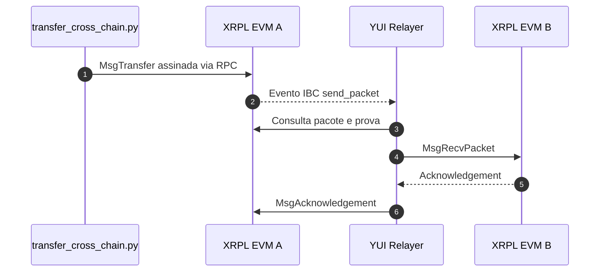

<div align="center" id="topo">

# <code><strong>Interoperabilidade XRPL EVM Sidechains locais via YUI Relayer</strong></code>

Ambiente local para validar interoperabilidade IBC entre chains XRPL EVM independentes usando o YUI Relayer e Docker Compose.

[](https://go.dev/)
[](https://docs.docker.com/engine/)
[](https://docs.docker.com/compose/)
[](https://www.python.org/)
[](https://ibcprotocol.dev/)
[](https://github.com/brunolima2696/yui-relayer)

</div>

---

# 📑 Índice

- [📌 Sobre](#sobre)
- [🏗️ Arquitetura](#arquitetura)
- [📁 Estrutura do projeto](#estrutura)
- [▶️ Como executar](#execucao)
- [⚙️ Modos do setup](#setup)
- [🧪 Transferência IBC](#transferencia)
- [➕ Adicionar uma chain](#nova-chain)
- [🧹 Limpeza](#limpeza)
- [📄 Código-fonte](#codigo-fonte)

---

<a id="sobre"></a>
# 📌 Sobre

O projeto sobe três chains XRPL EVM locais e independentes:

| Nome | Chain ID | RPC Cosmos | REST | RPC EVM |
|---|---|---:|---:|---:|
| `xrplevm-a` | `xrplevm_1450001-1` | `26657` | `1317` | `8545` |
| `xrplevm-b` | `xrplevm_1450002-1` | `36657` | `2317` | `9545` |
| `xrplevm-c` | `xrplevm_1450003-1` | `46657` | `3317` | `10545` |

O YUI Relayer realiza o handshake IBC — clients, connection e channel — e
relaya pacotes ICS-20 entre os paths configurados. O path padrão conecta
`xrplevm-a` e `xrplevm-b`.

O fork do YUI inclui compatibilidade com os eventos emitidos pelo `ibc-go v10`,
além do Dockerfile usado pelo Compose. Ele é mantido como submódulo Git no
commit validado pelo repositório principal.


[⬆ Voltar ao topo](#topo)

---

<a id="arquitetura"></a>
# 🏗️ Arquitetura



O teste envia a transação somente para a chain de origem. O relayer detecta o
evento `send_packet`, entrega o pacote no destino e devolve o acknowledgement.

[⬆ Voltar ao topo](#topo)

---

<a id="estrutura"></a>
# 📁 Estrutura do projeto

```text
xrpl-cosmos/
├── Dockerfile                  # build da imagem local do XRPL EVM Node
├── docker-compose.yaml         # chains e container persistente do YUI
├── chains.json                 # metadados, portas e chaves das chains
├── requirements.txt            # dependências dos scripts Python
├── relayer_config/
│   └── yui/                    # configuração e estado persistente do YUI
├── scripts/
│   ├── render_docker_compose.py
│   ├── setup_yui.py            # orquestrador do provisionamento
├── tests/
│   └── transfer_cross_chain.py # transferência ICS-20
├── utils/                      # consultas e conversões auxiliares
└── yui-relayer/                # submódulo do fork do YUI
```

[⬆ Voltar ao topo](#topo)

---

<a id="execucao"></a>
# ▶️ Como executar

## 1. Clonar o projeto

```bash
git clone --recurse-submodules https://github.com/brunolima2696/xrpl-cosmos.git
cd xrpl-cosmos
```

Se o repositório já foi clonado sem o submódulo:

```bash
git submodule update --init --recursive
```

## 2. Preparar o Python

No Git Bash do Windows:

```bash
python -m venv .venv
source .venv/Scripts/activate
python -m pip install -r requirements.txt
```

No Linux, use `source .venv/bin/activate` para ativar o ambiente.

Confirme o interpretador:

```bash
python -c "import sys; print(sys.executable)"
```

## 3. Configurar o ambiente

```bash
cp .env.example .env
```

O `.env.example` contém valores próprios para o ambiente local. Revise-os antes
de continuar.

## 4. Gerar o Compose

```bash
python scripts/render_docker_compose.py
```

O script usa o `chains.json` e o `.env`. Execute-o novamente após adicionar ou
alterar uma chain.

## 5. Subir os containers

```bash
docker compose up -d --build
docker compose ps
```

No primeiro boot, aguarde a criação do estado local das chains. O setup também
espera os RPCs ficarem disponíveis e a sincronização terminar.

Verificação opcional da chain A:

```bash
curl http://localhost:26657/status
```

```bash
curl -H "Content-Type: application/json" \
  -d '{"jsonrpc":"2.0","method":"eth_blockNumber","params":[],"id":1}' \
  http://localhost:8545
```

## 6. Configurar o YUI

```bash
python scripts/setup_yui.py
```

Sem argumentos, o setup:

1. verifica o YUI e os RPCs de todas as chains;
2. inicializa a configuração global;
3. gera e registra as chains do `chains.json`;
4. importa as chaves dos relayers;
5. completa seus saldos até 100 XRP, quando necessário;
6. inicializa os light clients locais;
7. registra o path `xrplevm-a-b`;
8. cria ou valida os IBC clients, a connection e o channel;
9. exibe os IDs resultantes.

As etapas existentes são reutilizadas ou ignoradas quando possível. O estado
fica persistido em `relayer_config/yui`.

## 7. Iniciar o serviço do relayer

Em outro terminal:

```bash
docker exec yui-relayer yrly service start xrplevm-a-b
```

Mantenha esse terminal aberto durante as transferências. O setup não inicia o
serviço automaticamente.

[⬆ Voltar ao topo](#topo)

---

<a id="setup"></a>
# ⚙️ Modos do setup

## Comportamento padrão

Configura todas as chains declaradas e abre o path A ↔ B:

```bash
python scripts/setup_yui.py
```

## `--config CHAIN`

Configura apenas a chain indicada, incluindo registro, chave, financiamento e
light client. A chain deve existir no `chains.json` e estar ativa no Compose.

```bash
python scripts/setup_yui.py --config xrplevm-d
```

Esse argumento não cria um path automaticamente.

## `--path SOURCE DESTINATION`

Registra o path e cria ou valida clients, connection e channel entre duas chains
já configuradas. A primeira chain será `src` e a segunda, `dst`.

```bash
python scripts/setup_yui.py --path xrplevm-a xrplevm-d
```

Nesse exemplo, o nome gerado será `xrplevm-a-d`.

## Combinação dos argumentos

É possível configurar uma nova chain e abrir seu path na mesma execução:

```bash
python scripts/setup_yui.py \
  --config xrplevm-d \
  --path xrplevm-a xrplevm-d
```

Os nomes devem corresponder exatamente ao campo `name` do `chains.json`.

Para consultar a configuração resultante:

```bash
docker exec yui-relayer yrly config show
```

[⬆ Voltar ao topo](#topo)

---

<a id="transferencia"></a>
# 🧪 Transferência IBC

O teste envia 1 XRP da chain A para a chain B.

## 1. Identificar o channel de origem

Ao final do setup, localize o channel exibido no endpoint `src`. Atualize estas
constantes em `tests/transfer_cross_chain.py`:

```python
SOURCE_CHAIN = "xrplevm-a"
SOURCE_CHANNEL = "channel-N"
DESTINATION_CHAIN = "xrplevm-b"
```

O número do channel depende do estado persistido e não é necessariamente
`channel-0`. Se as contas forem alteradas, revise também os endereços e a chave
privada definidos no teste.

## 2. Executar a transferência

Com `yrly service start` ativo em outro terminal:

```bash
python tests/transfer_cross_chain.py
```

Uma transação aceita pela origem apresenta `Code: 0` e um `TxHash`:

```json
{
  "Source Chain": "xrplevm-a",
  "Source Chain ID": "xrplevm_1450001-1",
  "Destination Chain": "xrplevm-b",
  "Destination Chain ID": "xrplevm_1450002-1",
  "Source Port": "transfer",
  "Source Channel": "channel-N",
  "Amount": "1 XRP",
  "Code": 0,
  "TxHash": "..."
}
```

O resultado também é acrescentado a `tests/logfile.jsonl`. `Code: 0` confirma a
submissão na origem; mantenha o YUI ativo para relayar o pacote e o ack.

## 3. Conferir o destino

```bash
python utils/check_balance_cosmos.py
```

Ou consulte diretamente a REST API da chain B:

```bash
curl http://localhost:2317/cosmos/bank/v1beta1/balances/ethm1dakgyqjulg29m5fmv992g2y66m9g2mjn6hahwg
```

O ativo recebido via IBC pode aparecer como voucher `ibc/<hash>`, além dos
saldos nativos em `axrp`.

[⬆ Voltar ao topo](#topo)

---

<a id="nova-chain"></a>
# ➕ Adicionar uma chain

1. Adicione a chain ao array `chains` do `chains.json`.
2. Garanta que IP e portas não conflitem com os serviços existentes.
3. Regenere e suba o Compose.
4. Configure a chain e, opcionalmente, um path.

```bash
python scripts/render_docker_compose.py
docker compose up -d --build

python scripts/setup_yui.py \
  --config xrplevm-d \
  --path xrplevm-a xrplevm-d
```

Inicie o serviço usando o nome informado pelo setup:

```bash
docker exec yui-relayer yrly service start xrplevm-a-d
```

[⬆ Voltar ao topo](#topo)

---

<a id="limpeza"></a>
# 🧹 Limpeza

Interrompa `yrly service start` com `Ctrl+C` e derrube os containers:

```bash
docker compose down
```

Esse comando preserva os volumes das chains e `relayer_config/yui`.

Para remover também os volumes nomeados e reinicializar o estado on-chain:

```bash
docker compose down -v
```

> `docker compose down -v` apaga o estado persistido das chains. Use somente
> quando quiser recriar o ambiente desde o genesis.

[⬆ Voltar ao topo](#topo)

---

<a id="codigo-fonte"></a>
# 📄 Código-fonte

- Projeto: [brunolima2696/xrpl-cosmos](https://github.com/brunolima2696/xrpl-cosmos)
- Fork YUI: [brunolima2696/yui-relayer](https://github.com/brunolima2696/yui-relayer)
- YUI upstream: [hyperledger-labs/yui-relayer](https://github.com/hyperledger-labs/yui-relayer)
- XRPL EVM Node: [xrplevm/node](https://github.com/xrplevm/node)

Para atualizar o submódulo após publicar uma alteração no fork:

```bash
git -C yui-relayer pull --ff-only origin main
git add yui-relayer
git commit -m "Update YUI relayer submodule"
```

[⬆ Voltar ao topo](#topo)
